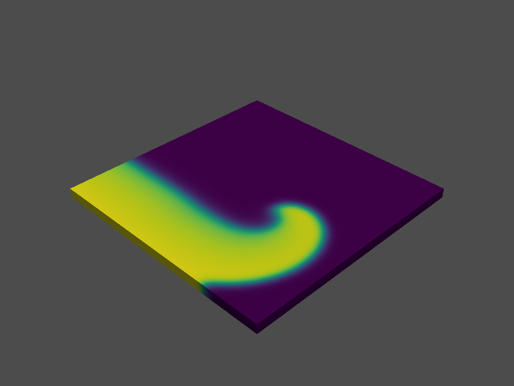
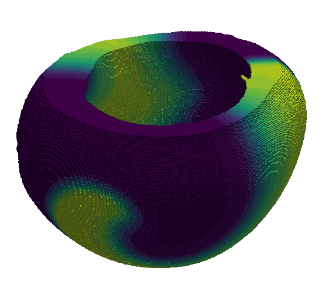

# Finitewave

**Finitewave** is a Python package for simulating cardiac electrophysiology using finite-difference methods.
It provides tools for modeling and visualizing the propagation of electrical waves in cardiac tissue,
making it ideal for researchers and engineers in computational biology, bioengineering, and related fields.

  
  
  

### Why Finitewave? 

Because of its simplicity and availability.
Finitewave is the most simple and user-friendly framework for cardiac simulation,
supporting a rich set of tools that make it accessible to both beginners and advanced users alike.

## Features

- Simulate 2D and 3D cardiac tissue models, including the ability to handle complex geometries.
- Simulate conditions such as fibrosis and infarction. 
- Built-in models, including the Aliev-Panfilov, TP06, Luo-Rudy91 models.
- Trackers for measuring various aspects of the simulation (such as activation time or EGMs) 
- Visualization tools for analyzing wave propagation.
- Customize simulation parameters to suit specific research needs.
- High-performance computing with support for GPU acceleration (currently under development).

## Package structure

*/finitewave*

Core package source code.

*/examples*

Scripts demonstrating various functionalities of the Finitewave package.

*/tests*

Unit tests to ensure the correctness and reliability of the package.

## License

This project is licensed under the MIT License. See the LICENSE file for details.
